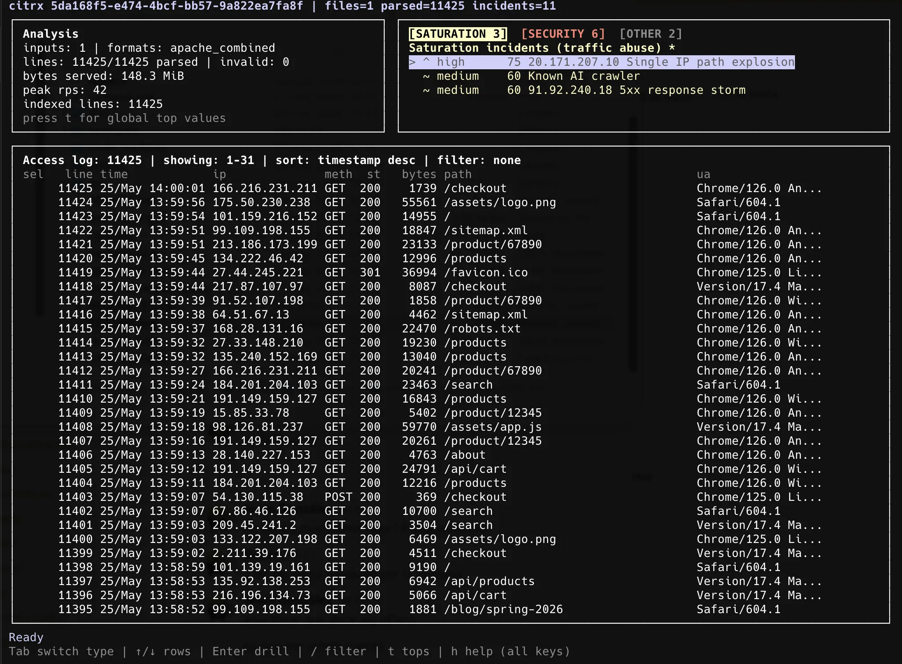
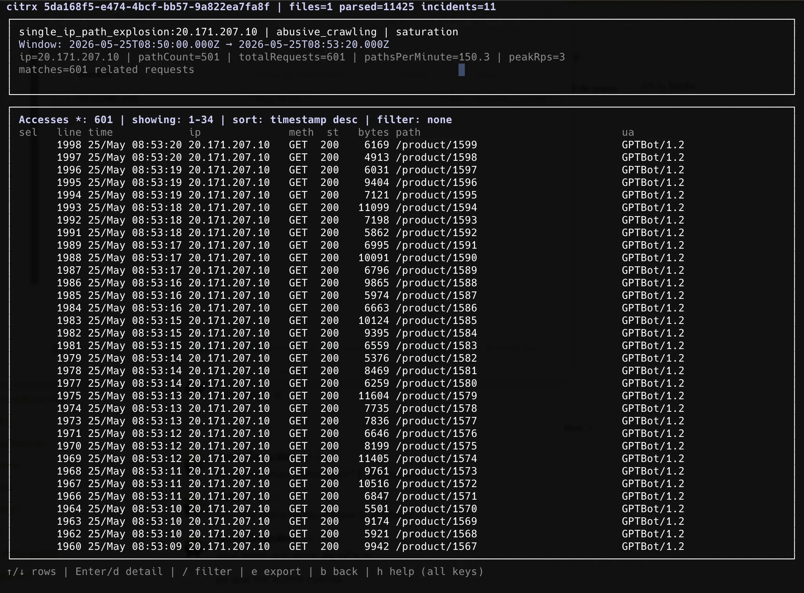
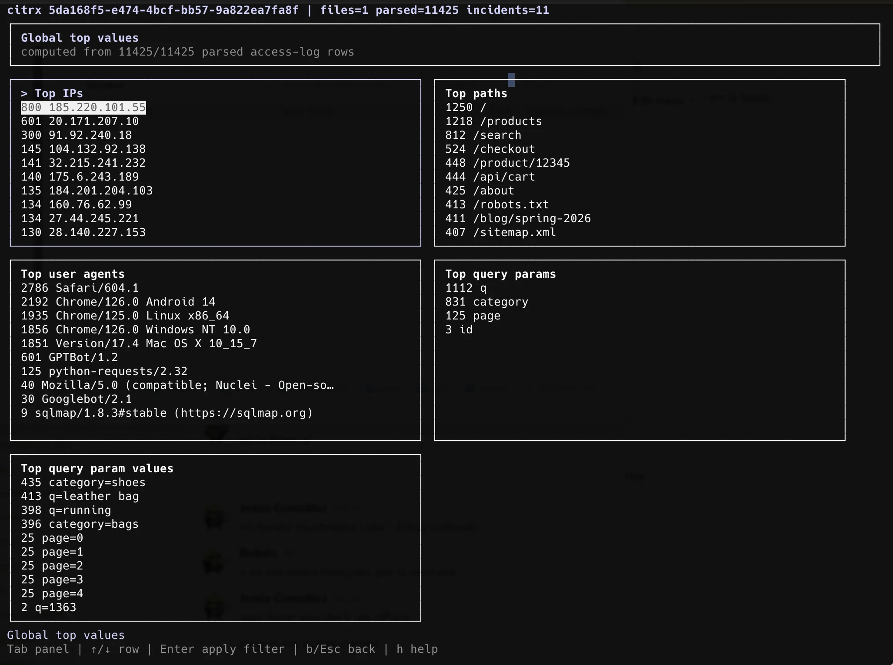
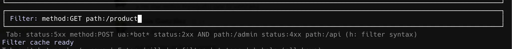
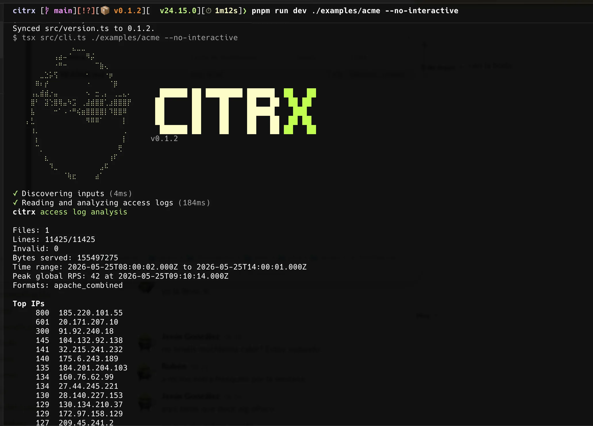
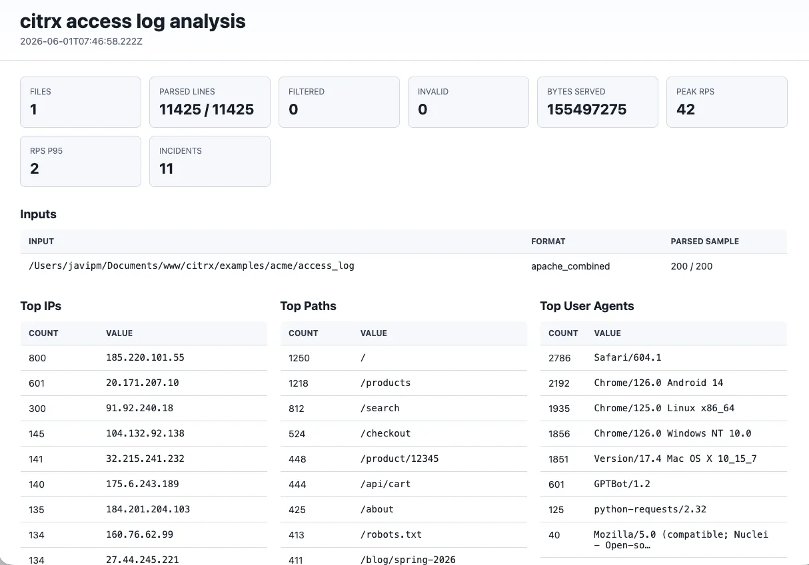

<div align="center">

# 🍋 citrx

### Local-first Apache & Nginx access-log analysis, in your terminal

Stream huge access logs, detect attacks and abuse with deterministic local
rules, explore everything in an interactive TUI — and only ask AI when **you**
decide to.

[](https://www.npmjs.com/package/@javipm/citrx)
[](https://nodejs.org)
[](https://www.typescriptlang.org/)
[](./LICENSE)
[](#-security--privacy)

**English** · [Español](./README_ES.md)

</div>

---

```bash
npx @javipm/citrx /var/log/nginx/access.log
```

That single command streams the log, validates it, runs ~30 detection rules, and
opens a full-screen TUI. No account, no upload, no telemetry.

<div align="center">

<!-- Drop a real capture at assets/tui-summary.webp — see assets/README.md -->


</div>

---

## 🖼️ Screenshots

<div align="center">

<table>
  <tr>
    <td width="50%"><br><sub><b>Summary</b> — incident tabs + indexed access-log table</sub></td>
    <td width="50%"><br><sub><b>Incident</b> — evidence + related access-log rows</sub></td>
  </tr>
  <tr>
    <td width="50%"><br><sub><b>Top values</b> — top IPs, paths, UAs, params</sub></td>
    <td width="50%"><br><sub><b>Filter</b> — query language across the log</sub></td>
  </tr>
  <tr>
    <td width="50%"><br><sub><b>Terminal report</b> — <code>--no-interactive</code></sub></td>
    <td width="50%"><br><sub><b>HTML report</b> — self-contained, offline</sub></td>
  </tr>
</table>

</div>

---

## 📑 Table of contents

- [Why citrx](#-why-citrx)
- [Features](#-features)
- [Quick start](#-quick-start)
- [What the output looks like](#-what-the-output-looks-like)
- [CLI reference](#-cli-reference)
- [Inputs & formats](#-inputs--formats)
- [Interactive TUI](#-interactive-tui)
- [Filtering](#-filtering)
- [AI mode (opt-in)](#-ai-mode-opt-in)
- [Reports](#-reports)
- [Detection rules](#-detection-rules)
- [Scoring](#-scoring)
- [Security & privacy](#-security--privacy)
- [Development](#-development)
- [License](#-license)

---

## 🤔 Why citrx

Access logs quietly hide expensive crawlers, scanner noise, fake bots,
SQLi/XSS payloads, POST abuse, and traffic spikes. `citrx` is built for DevOps,
security engineers, and backend developers who need fast answers to:

- **What happened?**
- **Which paths, IPs, methods, user-agents, and query params are involved?**
- **Which requests should I actually inspect?**
- **Which WAF / rate-limit rule would reduce the impact?**

The workflow is deliberately offline-first:

```
1. Run deterministic local analysis   →  no network, bounded memory
2. Explore incidents + raw requests    →  interactive TUI
3. Filter, sort, inspect, select rows  →  small query language
4. Ask AI — only when you press `a`     →  compact, redacted context
```

---

## ✨ Features

| | |
| --- | --- |
| 🌊 **Streaming** | Bounded-memory, line-by-line parsing. Multi-GB logs never load fully into RAM. |
| 🧭 **Format auto-detect** | Samples each input, picks `apache_common` / `apache_combined` / `nginx_combined`, fails early on non-access-log input. |
| 🧩 **Custom formats** | Declarative JSON config with one regex + named fields, validated with `zod`. |
| 🛡️ **~30 detection rules** | SQLi/XSS/LFI/SSRF/cmd-injection, recon, fake bots, scanners, DDoS bursts, AI crawlers, POST hotspots, error storms. |
| 🖥️ **Full TUI** | Incident tabs, indexed access-log table, on-demand row loading, top values, request detail, exports. |
| 🔎 **Query language** | `AND`/`OR`/`NOT`, parentheses, field operators, status families, wildcards, per-param filters. |
| 📤 **Reports** | Terminal, JSON, Markdown, and self-contained offline HTML. |
| 🤖 **Opt-in AI** | OpenAI is never called during analysis — only on explicit `a`, with redacted context. |
| 📦 **Compressed inputs** | `.gz`, `.br`, `.zip`, `.tar.gz`, `.tgz`, folders, and stdin. |
| 🔒 **Local-first** | No telemetry, secrets redacted, temp index deleted on exit. |

---

## 🚀 Quick start

### Run without installing

```bash
# npm
npx @javipm/citrx /var/log/nginx/access.log

# pnpm
pnpx @javipm/citrx /var/log/nginx/access.log

# yarn
yarn dlx @javipm/citrx /var/log/nginx/access.log

# bun
bunx @javipm/citrx /var/log/nginx/access.log
```

### Install globally

```bash
npm i -g @javipm/citrx
citrx /var/log/nginx/access.log
```

### Common invocations

```bash
# Analyze many paths, folders, and compressed files at once
citrx ./logs access.log.gz archive.zip

# Read from stdin
cat access.log | citrx -

# Non-interactive terminal report (CI, pipes, cron)
citrx access.log --no-interactive

# Structured reports
citrx access.log --json
citrx access.log --markdown --out report.md
citrx access.log --html     --out report.html

# Restrict a date range
citrx access.log --since 2026-05-25T00:00:00Z --until 2026-05-25T23:59:59Z

# Force a parser
citrx access.log --format apache_combined
```

> **Requirements:** Node.js `>=22` (developed and tested on `24.15`). `npx`/`pnpx`
> handle the rest.

**Exit codes** make `citrx` CI-friendly:

| Code | Meaning |
| ---- | ------- |
| `0`  | Success, no high/critical incidents |
| `1`  | Execution / configuration error |
| `2`  | High or critical incidents found |

---

## 📟 What the output looks like

Running the non-interactive report on a small synthetic log
(`citrx demo_access.log --no-interactive`):

```text
citrx access log analysis

Files: 1
Lines: 72/72
Invalid: 0
Bytes served: 86972
Time range: 2026-05-25T10:00:01.000Z to 2026-05-25T10:05:59.000Z
Peak global RPS: 3 at 2026-05-25T10:03:00.000Z
Formats: apache_combined

Top IPs
      60  8.8.4.4
       4  198.51.100.23
       3  45.83.66.12
       2  192.0.2.55
...

Known AI bots
       3  GPTBot ips=1 paths=1 robots=no

Security incidents (attacks)
  critical 100  SQL injection payload count=1
       ip: 198.51.100.23
       /index.php
       sample: /index.php?id=1+AND+SLEEP(5)
  critical  95  Known scanner user-agent count=4
       ip: 198.51.100.23
  critical  90  Sensitive file probe count=2 2XX_HIT
       ip: 198.51.100.23
       /.env
       /.git/config
  high      85  Known scanner user-agent count=2
       ip: 192.0.2.55
```

> `2XX_HIT` means the payload or probe received at least one `2xx` response —
> a *possible* successful reply worth inspecting, not proven compromise.

---

## 🧰 CLI reference

```text
Usage: citrx [options] <paths...>

Options:
  --json                  Write machine-readable JSON output.
  --markdown              Write Markdown output.
  --html                  Write a self-contained HTML report.
  --out <path>            Write report output to a file.
  --no-interactive        Print the terminal report instead of opening the TUI.
  --format <format>       auto, apache_common, apache_combined,
                          nginx_combined, or custom:<name>.   (default: auto)
  --format-config <path>  JSON file with custom access-log formats.
  --top <n>               Limit top lists.                    (default: 20)
  --since <date>          Include entries at or after this date.
  --until <date>          Include entries at or before this date.
  --include <glob>        Include paths matching this glob.
  --exclude <glob>        Exclude paths matching this glob.
  --no-color              Disable colored terminal output.
  --debug                 Print debug details on failure.
  -v, --version           Display the current version.
  -h, --help              Display help for command.
```

Environment:

- `NO_COLOR=1` — disable color.
- `CITRX_QUIET=1` — silence startup/progress noise for terminal output.

If stdout/stdin are TTYs and no report format is requested, `citrx` opens the
TUI by default. `--no-interactive` prints the terminal report instead.

---

## 📥 Inputs & formats

### Supported inputs

Individual files · folders · stdin (`-`) · `.gz` · `.br` · `.zip` · `.tar.gz` · `.tgz`

ZIP/TAR archives are scanned for candidate log files (`access.log`, `.log`,
`.txt`, extensionless logs, `.gz`, `.br`). Everything is streamed — full logs
are never read into memory. The TUI builds a **temporary** access-log index
under the OS temp dir and removes it on exit.

### Built-in formats

`apache_common` · `apache_combined` · `nginx_combined`

Default is `--format auto`: `citrx` samples each input, chooses the best parser,
and fails early when the sample doesn't look like an Apache/Nginx access log.

### Custom formats

One declarative JSON config, one regex with named groups, validated by `zod`:

```json
{
  "formats": [
    {
      "name": "pipe",
      "pattern": "^(?<ip>\\S+)\\|(?<timestamp>[^|]+)\\|(?<method>\\S+)\\|(?<target>\\S+)\\|(?<protocol>HTTP/[^|]+)\\|(?<status>\\d{3})\\|(?<bytes>\\S+)\\|(?<userAgent>.*)$",
      "fields": {
        "ip": "ip", "timestamp": "timestamp", "method": "method",
        "target": "target", "protocol": "protocol", "status": "status",
        "bytes": "bytes", "userAgent": "userAgent"
      }
    }
  ]
}
```

```bash
citrx access.log --format custom:pipe --format-config ./formats.json
```

Required fields: `ip`, `timestamp`, `method`, `target`, `protocol`, `status`.
Optional: `bytes`, `referer`, `userAgent`, `host`, `requestTime`, `upstreamTime`,
`forwardedFor`.

---

## 🖥️ Interactive TUI

When stdout/stdin are TTYs and no report format is requested, `citrx` opens a
full-screen terminal UI. It's the core product surface, not a debug view.

```
┌─ citrx ────────────────────────────────────────────────────────────────────┐
│  [ access log ] [ SATURATION ] [ SECURITY ] [ OTHER ]          Tab to switch │
├──────────────────────────────────────────────────────────────────────────────┤
│  #     IP              TIME      MTH  ST   BYTES  PATH                        │
│  3     198.51.100.23   10:01:11  GET  500      0  /index.php?id=1+AND+SLEEP.. │
│  5     198.51.100.23   10:01:12  GET  200   1200  /.env                       │
│  7     192.0.2.55      10:02:00  GET  404      0  /wp-admin/                  │
│ ...                                                                           │
├──────────────────────────────────────────────────────────────────────────────┤
│  f filter   s sort   t top   Enter detail   a ask AI   e export   h help     │
└──────────────────────────────────────────────────────────────────────────────┘
```

<div align="center">

<!-- assets/tui-incident.webp -->


</div>

### Summary screen

Incident area has three tabs (cycle with `Tab`: access log → SATURATION →
SECURITY → OTHER → access log):

| Tab | Contents |
| --- | --- |
| 🌊 **SATURATION** (default) | Rate bursts, DDoS, AI crawlers, abusive bots — traffic/resource abuse |
| 🛡️ **SECURITY** | SQLi/XSS/LFI payloads, recon, fake bots, scanner UAs — compromise attempts |
| 🗂️ **OTHER** | Low-signal / noise incidents filtered from the main panels |

```text
Tab              switch focus between access log and incident panels
↑/↓              move row            PgUp/PgDn   page through rows
Enter / d        open incident or request detail
f or /           filter access-log rows
s or S           open sort menu      t           global top values
Space            select current row  A           select visible rows
a                ask AI about current view/selection
e                open export menu (CSV, JSON, TSV)
r                reset filter, sort, and row selection
h                contextual help overlay (keys + filter syntax)
q                ask before quit
```

### Incident screen

Evidence + every related access-log line. Rows load on demand by fixed-size
buckets, so even huge incidents are responsive immediately. Filtering or sorting
a large incident shows background progress in the status bar — press `Esc` to
cancel and revert.

```text
↑/↓ · PgUp/PgDn  navigate            Enter / d   open request detail
t                top values for this incident (computed from full row set)
f · s/S          filter · sort       Space · A   select row · visible page
a · e            ask AI · export     r           reset filter + selection
b                back to summary
```

### Top values · request detail · export

- **Top values** (`t`): top IPs, paths, user-agents, query params, and param
  values. Respects the active filter. `Enter` applies a filter from a value.
- **Request detail** (`Enter`/`d`): full source, timestamp, IP, method, status,
  bytes, path, target, user-agent, and raw line with wrapping.
- **Export** (`e`): CSV / JSON / TSV. Summary exports the selected rows or the
  full filtered result; incident export streams all filtered rows to a temp file
  and atomically renames it when done. `Esc` aborts a running export.

> Long-running filter/sort/top/export operations always show a loading state —
> the app never *looks* frozen — and `Esc` consistently cancels the active
> operation before navigating.

---

## 🔎 Filtering

Filters work on the global access log, incident rows, and top-value drill-downs.
Case-insensitive, with a small query language:

- plain text searches across IP, time, method, path, target, status, bytes, UA, raw line
- adjacent terms mean `AND`; explicit `AND`, `OR`, `|`, parentheses, and `!`/`NOT`
- `:` = contains, `=` = exact, `!=` = negated match
- `>`, `>=`, `<`, `<=` for `status`, `bytes`, `line`
- status families: `status:2xx`, `status:3xx`, `status:4xx`, `status:5xx`
- anchored wildcards: `ip:66.249.*`
- quoted values for spaces/symbols: `ua:"Googlebot/2.1"`
- URL-encoded values are decoded before matching

```text
method:POST status:200 url:*admin*
(method:POST OR method:PUT) status:2xx
(status:403 | status:404) !ua:*Googlebot*
ip:66.249.* bytes>50000
status:5xx path:/checkout
method!=GET status>=400
param:q                # any request with a q parameter
param:q=*select*       # q value contains "select"
param:*=*sleep*        # any param value contains "sleep"
raw:"union select"
source:access.log line>=10000 line<20000
```

**Fields:** `ip, method, status, path, target, url, ua, bytes, param, query, source, line, time, raw`

**Aliases:** `url→target`, `timestamp→time`, `userAgent→ua`, `st→status`,
`ln→line`, `src→source`, `qs→query`, `mth→method`, `params→param`

Bare text is great for quick hunting — `googlebot checkout` requires both words
somewhere in the searchable line.

---

## 🤖 AI mode (opt-in)

OpenAI is **never** called during analysis — only when you press `a` in the TUI
and `OPENAI_API_KEY` is set.

```bash
export OPENAI_API_KEY="sk-proj-..."

# optional
export CITRX_OPENAI_MODEL="gpt-5.4-mini"
export CITRX_AI_MAX_LINES="200"
export CITRX_AI_MAX_CHARS="60000"
```

It receives **compact, redacted** context only:

- report summary + time stats
- top IPs / paths / methods / statuses + behavior stats
- selected incident evidence
- selected rows, or visible filtered rows when nothing is selected
- user-agent references instead of repeating long UAs

The answer renders in a dedicated scrollable screen with lightweight Markdown.
Access logs contain no ASN data, so the model is instructed never to invent
ASN/organization details.

---

## 📊 Reports

| Format | Flag | Notes |
| --- | --- | --- |
| Terminal | `--no-interactive` (or non-TTY) | Colored summary + incidents |
| JSON | `--json` | Machine-readable, typed report model |
| Markdown | `--markdown` | Great for tickets / PRs |
| HTML | `--html` | **Self-contained, offline, no external resources** |

Use `--out <path>` to write to disk. HTML reports embed CSS/JS, escape all data,
ship sortable/filterable tables, and are print/PDF friendly.

---

## 🛡️ Detection rules

Every incident carries a `kind` that drives its TUI panel:

| Kind | Panel | Examples |
| --- | --- | --- |
| `compromise` | 🛡️ SECURITY | SQLi/XSS/LFI payloads, recon, fake bots, scanner tools |
| `saturation` | 🌊 SATURATION | DDoS bursts, AI crawlers, abusive crawlers, POST hotspots |
| `noise` | 🗂️ OTHER | Low-signal patterns unlikely to need immediate action |

<details>
<summary><strong>Payload &amp; recon rules</strong></summary>

| ID prefix | Category | Kind | Meaning |
| --- | --- | --- | --- |
| `sqli:` | `sql_injection` | compromise | `union select`, sleep/benchmark, encoded SQL |
| `xss:` | `xss` | compromise | script/browser execution indicators |
| `lfi_rfi:` | `path_traversal` | compromise | traversal, LFI/RFI, `php://filter`, sensitive paths |
| `ssrf:` | `ssrf` | compromise | localhost, metadata IPs/hosts, callback-like params |
| `command_injection:` | `command_injection` | compromise | shell metacharacters + command indicators |
| `recon_sensitive_file:` | `recon` | compromise | probes for `.env`, `.git`, backups, dumps |
| `rare_method:` | `http_anomaly` | noise | uncommon methods (`CONNECT`, `TRACE`, `OPTIONS`) |

Payload incidents are grouped **by attacker IP** (one incident per IP). Scoring
by response outcome:

- any `2xx` → SECURITY, `critical/100` + `2XX_HIT` (payload landed)
- any `5xx` → SECURITY, `critical/90`
- only blocked/redirected → OTHER noise (context, not proven impact)

`recon_sensitive_file` needs ≥2 successful responses or a 10% success ratio to
avoid flagging ordinary 404 scanners.

</details>

<details>
<summary><strong>Aggregate path, rate / DDoS, error-storm rules</strong></summary>

| ID prefix | Category | Kind | Meaning |
| --- | --- | --- | --- |
| `abusive_crawl:` | `abusive_crawling` | saturation/noise | served path pressure or distributed crawling on a non-entrypoint path |
| `query_explosion:` | `abusive_crawling` | noise | one path with many query variants |
| `post_hotspot:` | `post_hotspot` | noise | endpoint with unusually many POSTs |
| `ddos_rps_burst_single_ip:` | `ddos` | saturation | one IP exceeds per-second RPS for consecutive seconds |
| `ddos_global_rps_spike` | `ddos` | saturation | global RPS over baseline for consecutive seconds |
| `http_head_flood:` | `ddos` | saturation | one IP with high ratio + peak of HEAD requests |
| `ddos_distributed_subnet:` | `ddos` | saturation | IPv4 `/24` or IPv6 `/48` over RPS + unique-IP thresholds |
| `http_4xx_storm:` | `http_anomaly` | noise | one IP, many 4xx in adjacent minute buckets |
| `http_5xx_storm:` | `http_anomaly` | saturation | one IP, many 5xx in adjacent minute buckets |

</details>

<details>
<summary><strong>Bot &amp; scanner rules</strong></summary>

| ID prefix | Category | Kind | Meaning |
| --- | --- | --- | --- |
| `ai_scraper_known:` | `ai_scraper` | saturation/noise | known AI crawler/assistant UA, grouped by bot |
| `scanner_ua_known:` | `scanner` | compromise | known scanner/offensive tooling UA |
| `scanner_signature_paths:` | `scanner` | compromise | one IP touches many fingerprint paths |
| `single_ip_path_explosion:` | `abusive_crawling` | saturation | one IP > 10 unique paths/minute sustained |
| `ua_rotation_same_ip:` | `http_anomaly` | noise | one IP, many UAs **and** peak RPS ≥ 5 |
| `fake_bot_googlebot:` | `fake_bot` | compromise | claims Googlebot but IP outside published ranges |
| `fake_bot_bingbot:` | `fake_bot` | compromise | claims bingbot but IP outside published Bing ranges |

Notes: `single_ip_path_explosion` needs **pathsPerMinute ≥ 10** (asset-heavy page
loads don't trigger it). `abusive_crawl` enters SATURATION only with real served
volume + a served-per-minute peak. `fake_bot_*` needs ≥10 requests. Verified
Googlebot/Bingbot IPs are excluded from all bot/scanner detections.

Refresh the bundled Googlebot/Bingbot IP-range snapshots with:

```bash
pnpm run update-bot-ranges
```

</details>

---

## 🎯 Scoring

Each incident has `kind`, `severity`, `score` (0–100), typed `evidence`,
redacted `samples`, and `successful?`.

| Score | Severity |
| --- | --- |
| 0–24 | `info` |
| 25–49 | `low` |
| 50–74 | `medium` |
| 75–89 | `high` |
| 90–100 | `critical` |

Post-processing multipliers:

- `+10` when the same `evidence.ip` appears in ≥2 incidents (correlated attacker)
- `+15` when a pattern persists ≥30 min (persistence bonus)
- `−10` for moderate AI crawlers that requested `robots.txt`

Persistence bonus does **not** apply to `ai_scraper_known:*` — AI crawlers run
for weeks, so duration alone isn't a signal. Panels sort by `kind` weight
(compromise → saturation → noise), then by score descending.

---

## 🔒 Security & privacy

- **Local analysis first** — no network call during analysis.
- **No telemetry**, ever. (If ever added, strict opt-in only.)
- **AI only on explicit `a`**, with redacted context.
- **Secrets redacted** in URL/query values:
  `token, _token, sid, session, password, passwd, key, secret, jwt, auth, authorization`
- **HTML output escaped**; log content is never executed.
- **Temp TUI index** files are deleted on exit.

Treat logs, exported JSON, paths, IPs, and route names as **sensitive customer
data** — keep them out of public commits.

---

## 🛠️ Development

```bash
pnpm install
pnpm run typecheck
pnpm test
pnpm run build

# run from source against a fixture
pnpm run dev -- examples/your.log
pnpm run dev -- examples/your.log --json
```

Project layout:

```
input/    path discovery, stdin, compressed/archive readers
parser/   format detection, parser registry, built-in + custom parsers
analysis/ streaming aggregation, behavior tracking, incident match sets
rules/    deterministic request/path rules and scoring
run/      temporary run workspace and access-log index
tui/      Ink screens, hooks, filters, tables, overlays
ai/       compact redacted context builder + OpenAI client
report/   terminal, JSON, Markdown, HTML renderers
```

**Stack:** TypeScript (ESM) · `commander` · `ink` + React · `zod` ·
`picocolors` · official `openai` SDK · Vitest.

---

## 📄 License

[MIT](./LICENSE) © [javipm](https://github.com/javipm)

<div align="center">
<sub>Built for people who read their access logs. 🍋</sub>
</div>
